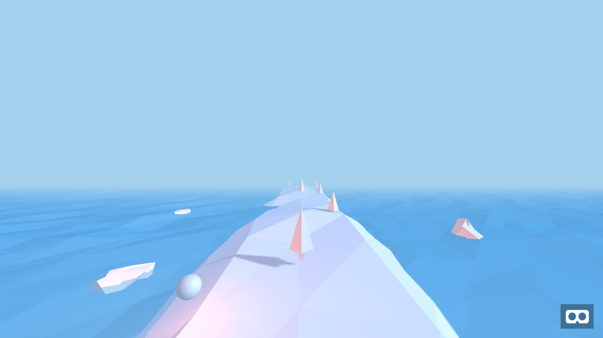

# Ergo for Unity

A Unity port of [Ergo](https://github.com/alvinwan/ergo) by Alvin Wan, an endless runner first built for the web with
A-Frame (WebVR). Roll along a low-poly ridge in the middle of the sea, switch between three lanes and dodge the
trees. Every tree that passes scores a point.

The port recreates the original scene with the same numbers: the same layout, colours, lights and fog, and the
same low-poly shapes, because the same seeded random generator is used. The game rules are unchanged: a row of
trees every 500 ms, at most two trees per row, the same hit zone and scoring.



*Reference: the original A-Frame build rendered offline. Its text did not appear here because the fonts are
served from a CDN.*

## Open and play

1. Install **Unity 6000.0 LTS**. The project is pinned to 6000.0.69f1. Newer Unity 6 versions upgrade it when
   you open it.
2. In Unity Hub, choose **Add → Add project from disk** and select this folder.
3. The first time the project opens, the game scene (`Assets/Ergo/Scenes/Ergo.unity`) opens automatically. If it
   doesn't, use **Ergo → Open Game Scene**.
4. Press **Play**, or use **Ergo → Play**.

No setup step is needed. The `Ergo` object in the scene builds the whole world when the game starts.

## Controls

| | Desktop | Mobile (phones and tablets) |
|---|---|---|
| Start / restart | Press any key | Look at **Start** or **Restart** for a quarter of a second, or tap |
| Change lane | `A` / `D` or `←` / `→` | Turn the device about 6° left or right (or drag sideways) |
| Look around | Drag with the left mouse button | Move the device (gyroscope) and drag sideways |

To try the mobile controls in the editor, select the **Ergo** object and set **Settings → Control Scheme** to
*Mobile*. Dragging with the mouse then stands in for turning your head.

All of the original game's numbers are listed under **Settings** on the `Ergo` object: lanes, spawn rate, tree
speed and curve, hit zone, colours, fog and shadows. Their default values are the originals.

## How the original maps to this project

| Original (web) | Unity port |
|---|---|
| `index.html` scene: camera, lights, icebergs, oceans, platform, trees, texts, menus, player | `ErgoWorld.cs` builds the same entities with the same values |
| `runner.js`: `movePlayerTo`, `startGame`, `gameOver`, `addTreesRandomly`, collision and score tick | `ErgoSimulation.cs` (engine-independent rules) and `ErgoGame.cs` (menus, input, visuals) |
| `lane-controls` (head yaw > 0.1 rad picks a side lane) and `look-controls` | `ErgoGame.Update` and `CameraLook.cs` |
| Gaze `cursor` with `fuse: true; fuseTimeout: 250` and its "fusing" animation | `GazeCursor.cs` and `ClickTarget.cs` |
| `<a-animation>` (icebergs, bobbing ball, flickering light) | `AFrameAnimation.cs`, which uses the same Tween.js easing curves (`Easing.cs`) |
| `lp-cone` from aframe-low-poly 0.0.2 | `ThreeGeometry.Cylinder` and `ThreeGeometry.Jitter`, which reproduce three.js' vertex order and the xfnv1a/mulberry32 generator (`LowPolyRandom.cs`) |
| `a-ocean` (aframe-extras) | `OceanSurface.cs` |
| `a-text` with the `exo2bold` font | `WorldText.cs` with Exo 2 Bold, using A-Frame's width-based sizing and word wrapping |
| three.js r87 lighting, linear fog and PCF shadow map | `Ergo/Lit` shader and `ErgoRenderer.cs` |

A-Frame is right-handed and looks down −Z; Unity is left-handed and looks down +Z. `AFrame.cs` mirrors the Z axis.
That keeps the picture the same and lets values from `index.html` be copied as they are.

## Rendering

The look comes from four small shaders in `Assets/Ergo/Resources/Ergo/Shaders`:

- The lighting model is three.js r87's, as A-Frame 0.7 used it: ambient light, a directional light, and an
  orange point light inside the ball with no falloff. The ball's light is what gives surfaces facing the player
  their pink glow.
- The maths runs on the authored sRGB colours, like the original, and the result is converted to the project's
  colour space. Colours match in both Linear and Gamma projects.
- Fog is linear fog blended with `smoothstep`, as in three.js.
- Shadows are three.js' default shadow camera: 512 px, a 10 × 10 m orthographic view, 3 × 3 PCF, and only the
  faces turned away from the light are drawn into the map. As in the original, only the area around the player
  gets shadows.

The shaders use only their own global values, so the project renders the same with the Built-in Render Pipeline
(the default here) and with URP.

## Differences from the original

- **Not ported:** MirrorVR. The original mirrored a phone's game to desktop viewers through an external
  socket.io service, and showed a "default room" banner for it. The WebVR/Cardboard stereo mode is not included
  either (see *VR* below).
- **Same curve:** the markup says `ease="linear"` for the trees, but A-Frame only reads `easing`, so the trees
  actually moved with A-Frame's default cubic ease-in-out. The port keeps that. You can change it with
  **Settings → Tree Easing**.
- **Small fixes:**
  - The hit test also checks the distance a tree moved since the last frame. A slow frame can no longer let a
    tree pass through the player.
  - Restarting no longer counts trees that were already scored in the last run.
  - The gaze cursor checks every frame instead of once a second.
- **Mobile orientation:** the gyroscope is mapped to the camera the same way Unity's Input System compensates
  for screen orientation. It was written without a device to test on, so check it on hardware.

## VR

To add a headset or Cardboard mode:

1. Install **XR Plugin Management** and a provider, such as OpenXR.
2. Drive the camera with a `TrackedPoseDriver`, and turn off **Settings → Look Controls** on the `Ergo` object.

Lane selection already follows the camera's heading, so head turning works as it did in the original. The Ergo
shaders do not support single-pass instanced stereo, so use multi-pass rendering or extend the shaders.

## Tests

Open **Window → General → Test Runner → EditMode** and choose **Run All**. The tests compare the port with values
recorded from the original game running in a browser:

- the low-poly random sequence and the platform vertices;
- the tree motion curve;
- the spawn cadence and row sizes;
- collisions and scoring.

## Project layout

```
Assets/Ergo/
  Scenes/Ergo.unity                  scene with the camera and the Ergo object
  Scripts/Runtime/                   game code (assembly "Ergo")
  Scripts/Editor/                    Ergo menu and opening the scene on first launch
  Resources/Ergo/Shaders/            Ergo/Lit, Ergo/Text, Ergo/Unlit and the shadow caster
  Resources/Ergo/Fonts/              Exo 2 Bold and its licence
  Tests/EditMode/                    NUnit tests
Docs/                                reference render of the original
```

Input works with either Unity input backend. The project uses the Input System package, and it falls back to the
legacy Input Manager if that is the only one enabled.

## Credits and licences

- Original game: Ergo, © 2019 Alvin Wan, MIT licence.
- Low-poly primitives: aframe-low-poly, © 2018 Alvin Wan, MIT licence.
- Ocean: aframe-extras, © 2016 Don McCurdy, MIT licence.
- Font: Exo 2, © 2013 The Exo 2 Project Authors, SIL Open Font License 1.1.

The full notices are in [THIRD-PARTY-NOTICES.md](THIRD-PARTY-NOTICES.md).
